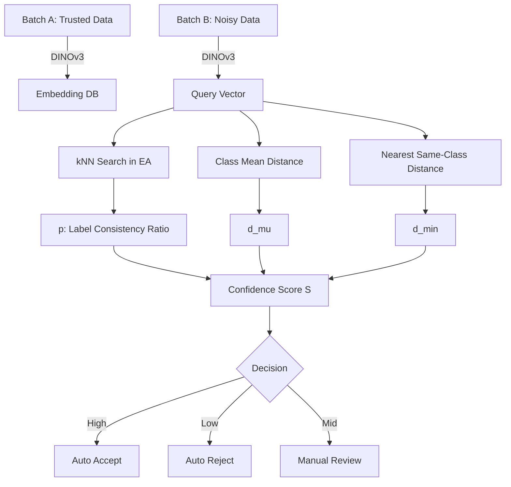

# 📘 Label Consistency Validation via DINOv3 Embedding

## 1. Problem Definition

Given two datasets:

* **Batch A**: High-quality labeled image dataset (trusted labels)
* **Batch B**: Noisy labeled image dataset (to be cleaned)

Each image is encoded using **DINOv3** into an embedding vector:

$$
f: \mathcal{X} \rightarrow \mathbb{R}^d
$$

We aim to determine whether a sample ( x \in \text{Batch B} ) with label ( y ) is **likely correctly labeled**, by comparing it against the embedding distribution of Batch A.

---

## 2. Core Hypothesis

For each class ( c ), embeddings of Batch A approximately follow a class-conditional manifold distribution:

$$
f(X) \mid Y=c \sim \mathcal{M}_c
$$

A correctly labeled sample should lie inside the high-density region of ( \mathcal{M}_c ).

---

## 3. Overall Pipeline



---

## 4. Mathematical Formulation

### 4.1 kNN Label Consistency

Given a sample ( x ) from Batch B, retrieve its k nearest neighbors from Batch A:

$$
N_k(x) = {(v_i, y_i)}_{i=1}^k
$$

Define label consistency ratio:

$$
p = \frac{1}{k} \sum_{i=1}^{k} \mathbb{I}(y_i = y)
$$

---

### 4.2 Class Mean Distance

For class ( y ), compute:

$$
\mu_y = \frac{1}{|A_y|}\sum_{v \in A_y} v
$$

Distance:

$$
d_\mu = ||x - \mu_y||
$$

Normalize:

$$
d_\mu^{norm} = \frac{d_\mu}{\text{mean}(||v-\mu_y||)}
$$

---

### 4.3 Nearest Same-Class Distance

$$
d_{min} = \min_{v \in A_y} ||x-v||
$$

Normalize similarly.

---

## 5. Confidence Score

$$
S = w_1 p - w_2 d_{min}^{norm} - w_3 d_\mu^{norm}
$$

Recommended weights:

```
w1 = 1.0
w2 = 0.5
w3 = 0.5
```

---

## 6. Decision Policy

| Condition  | Decision      |
| ---------- | ------------- |
| S ≥ T_high | Accept        |
| S ≤ T_low  | Reject        |
| else       | Manual Review |

Typical:

```
T_high = 0.4
T_low  = -0.4
```

---

## 7. Statistical Justification

This approach approximates:

$$
P(Y=y | X=x) \propto p(x|y)P(y)
$$

Using:

* kNN as non-parametric density estimation
* distance metrics as Gaussian-like radial approximation

---

## 8. Complexity

| Step       | Complexity      |
| ---------- | --------------- |
| Embedding  | O(N)            |
| kNN Search | O(log N) (HNSW) |
| Scoring    | O(k)            |

---

## 9. Pseudocode

```python
def validate_label(x, y, db):
    knn = db.query(x, k=20)
    p = sum(1 for v in knn if v.label == y) / 20

    mu = class_mean[y]
    d_mu = norm(x - mu) / class_radius[y]

    d_min = min(norm(x - v) for v in class_vectors[y])
    d_min /= class_nearest_mean[y]

    S = p - 0.5*d_min - 0.5*d_mu

    if S > T_high:
        return "ACCEPT"
    elif S < T_low:
        return "REJECT"
    else:
        return "REVIEW"
```

---

## 10. Visualization Recommendation

* UMAP / t-SNE colored by ACCEPT / REJECT / REVIEW
* Confidence score histogram
* ROC on small manually verified subset

---

## 11. Extension (Optional)

* Mahalanobis distance
* Class covariance modeling
* Bayesian threshold learning
* Adaptive class-wise thresholds

---

## 12. Why This Works

Because representation learning aligns semantic similarity with geometric proximity, making label consistency equivalent to local neighborhood purity and global distribution compatibility.

---

## 13. Reference Keywords

* Confident Learning
* kNN Label Noise Detection
* Deep Metric Label Validation
* Representation Consistency

---

## 14. Notes on Validation

This method assumes Batch A is clean. If Batch A contains noise, iterative self-cleaning must be applied.

---

## 15. Output Format Example

```json
{
  "image_id": "xxx.jpg",
  "label": "cat1",
  "score": 0.62,
  "decision": "ACCEPT"
}
```
